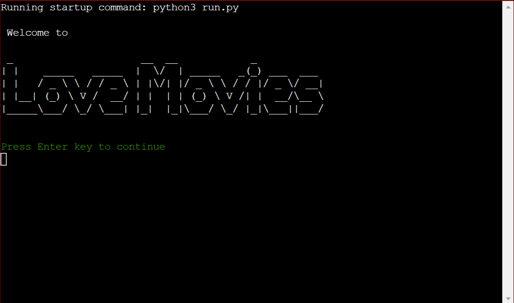
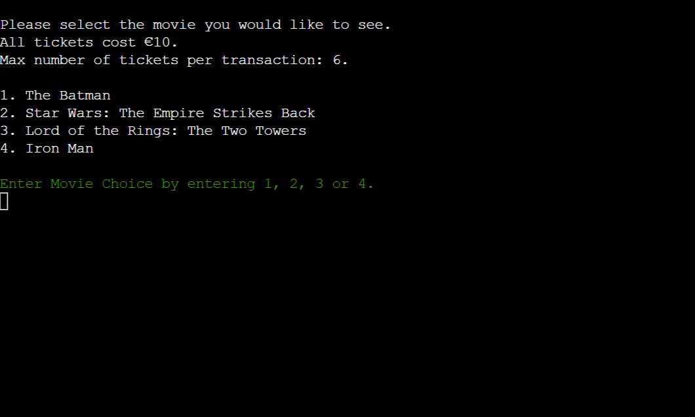
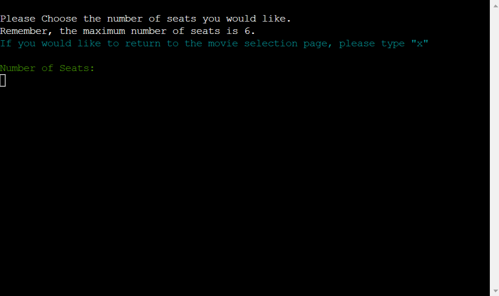
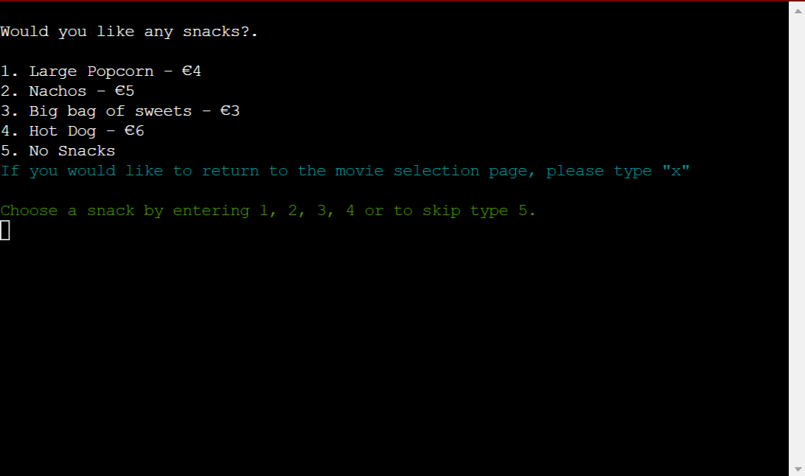
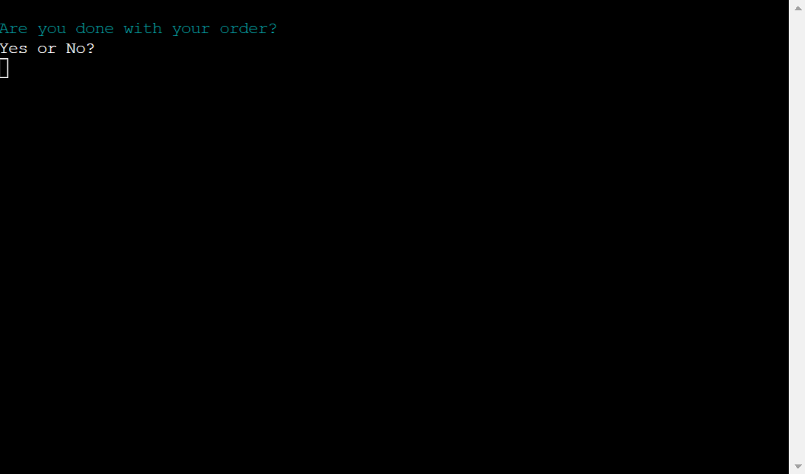
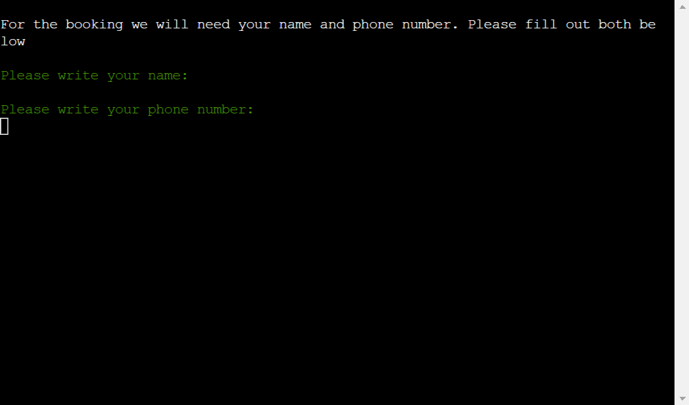
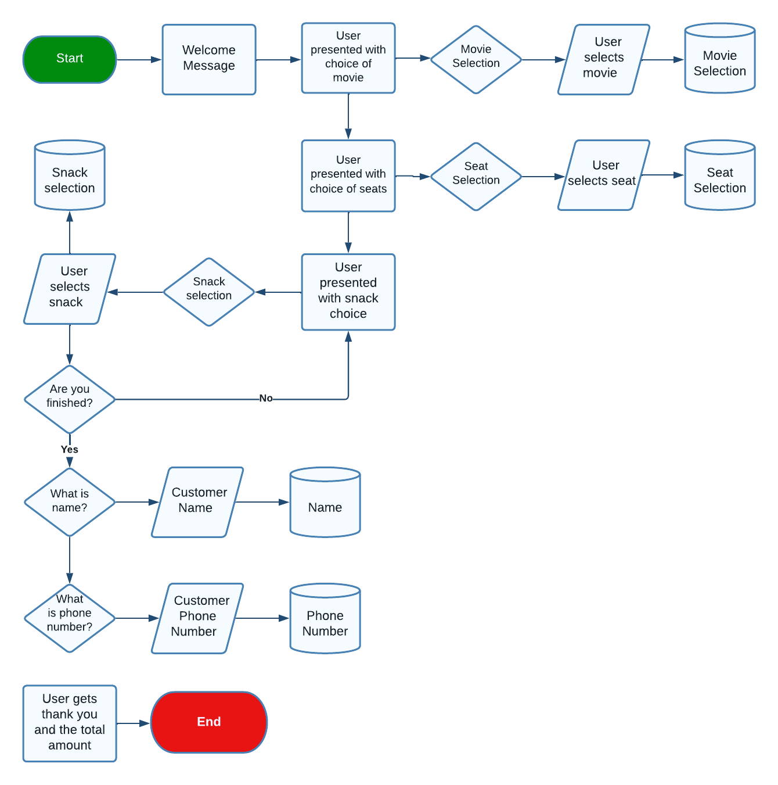
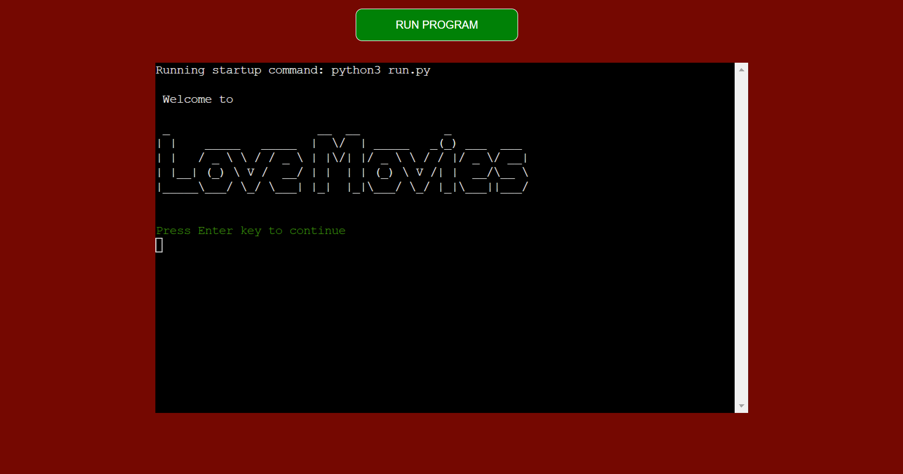

# Love Movies Cinema Booking System

[Love Movies Live Site](https://love-movies123.herokuapp.com/)

[Github Repo](https://github.com/JamieT966/project-portfolio-3)

[Love Movie | Google Sheet](https://docs.google.com/spreadsheets/d/1lRwULDPoOX6kcolSmjcIYGjfdGSxWS7DOEIY1fG5638/edit?usp=sharing)

Love Movies is in need of a cinema booking system. This booking system will allow Love Movies to have customers book cinema tickets online with various movie choices. Within the same booking system customers can order as many snacks as they like or none at all. At the end the customer is presented with their details and the total cost.

**The business goals of this quiz:**
* Allows booking of movies online which will increase sales as another sales channel has been opened.
* Online booking means that customers are guaranteed a seat and will result in less unhappy customers.
* Also allows the ordering of snacks online which will increase revenue.

**The customer goals of this quiz:**
* Clear and easy way to book their favourite movies with ease.
* Provides customers with an easy way to order snacks.
* Allows the customer to book multiple seats.

## **Features**

### Love Movies | Introduction Screen

* The user is first met with a welcome screen introducing them to Love Movies. Featuring Love Movies written in a pyfiglet style. With the option to start the program in green colouring. 

### Love Movies | Movie Selection Screen

* This screen features information on ticket price cost and displays all current movies being shown at Love Movies. There is an input required of 1-4 depending on what movie a customer would like to see.

### Love Movies | Seat Selection Screen

* The seat selection screen asks the user how many tickets they would like. Below it tells the user the maximum amount of tickets that can be purchased.

* This screen also features an exit button, that when 'x' is input, will restart the program.

### Love Movies | Snack Selection Screen

* The customer is presented with a choice of snacks on this screen. The customer can choose between 4 snacks with an option for no snacks.

* This screen also features an exit button, that when 'x' is input, will restart the program.

### Love Movies | Order Complete? Screen

* When a customer has selected a snack from the snack selection screen they are taken to this screen asking if their order is complete. 

* If the customer inputs yes they are taken to the next screen. If the customer inputs no they are taken back to the snack selection screen to chose another snack.

### Love Movies | Contact Details Screen

* This screen prompts the user for their name and phone number.

* The phone number input is then validated to ensure that it is a number.

### Love Movies | End Screen

* The end page will thank the user for booking using the name provided in the contact details screen.

* It will then inform the user that if Love Movies has any issues or needs to contact them they will get in touch with the phone number provided in the contact details screen.

### Features Left to Implement in The Future

* Different ticket prices is something that could be looked at as a future development. For example, Adult, Child, Student. Love Movies could also implement different prices for different movies in the future.

* In the future, I would like to improve upon the Google Sheets database so any no coding person is able to enter and remove movies when necessary.

* Another feature to implement would be for each order to have a unique booking reference.

## **Testing**

|Test Description|Expected Outcome|PASS/FAIL|Comments|
|:----|:----|:----|:----|
|When input on movie selection screen is selected the correct input is returned.|1 = The Batman|PASS|Input passes for all numbers 1-4|
|When other input is entered on the movie selection screen an error is returned and question repeats.|cat = Sorry, we were looking for a number between 1 and 4.|PASS|Anything other than 1-4 entered results in that error message.|
|When input on seat selection is 1-6 it runs.|1-6 input results in the
program running.|PASS|Works.|
|When other input is entered on the seat selection screen an error is returned and question repeats.|dog = Sorry, we were looking for a number between 1 and 6.|PASS|Anything other than 1-6 entered results in that error message.|
|When ‘x’ input is entered on the seat selection screen an error is returned and question repeats.|Returns user to start of program|PASS|Program does what it says.|
|When input on snack selection screen is selected the correct input is returned.|3 = Nachos|PASS|Input passes for all numbers 1-5|
|When other input is entered on the seat selection screen an error is returned and question repeats.|72 = Sorry, we were looking for a number between 1 and 5.|PASS|Anything other than 1-5 entered results in that error message.|
|When ‘x’ input is entered on the snack selection screen an error is returned and question repeats.|Returns user to start of program|PASS|Program does what it says.|
|When input of ‘yes’ is entered the program continues.|Yes = program continues|PASS|Program advances.|
|When input of ‘no’ is entered the program continues.|No = program loops back to snack selection.|PASS|Program loops back to snack selection.|
|Name input is prompted|Yes = Please write your name: appears next.|PASS|Program runs as expected.|
|Phone number input is prompted|Yes = Please write your phone number:
appears next.|PASS|Program runs as expected.|
|When anything other than a number is entered an error occurs.|frog = Phone number
can only contain numbers.|PASS|Anything that is not a digit is rejected with error.|
|2 tickets for The Batman, Large Popcorn and Nachos|€29|PASS|Result: €29|
|4 tickets for Star Wars: The Empire Strikes Back, Big bag of sweets and Hot Dog|€49|PASS|Result: €49|
|5 tickets for Lord of the Rings: The Two Towers, no snacks|€50|PASS|Result: €50|
|1 ticket for Iron Man, Large Popcorn and Hot Dog|€20|PASS|Result: €20|

## **Bugs**

* I had experienced a bug/ issue when declaring the variable movies as this was given as an index but declaring a global variable for this has solved my issue.

* A second bug/ issue that I faced was that when adding the variables ticket_total and ticket price it threw an error. Once I converted them both to integers with the int() method it fixed itself.

## **User Experience**

### Strategy

Love Movies needed an online booking system to aid in their day to day operations. Without an online booking system they could not offer their customers best in class convenience.

### Scope

I decided that a basic online booking system that allowed the customer to book multiple seats for any movie alongside a selection of snacks that gave an end total was within scope. This system would also update a Google Sheet database of the number of seats booked.

Unfortunately, due to time constraints, the ability to offer multiple ticket prices, such as Adult, Child and Student fell out of scope. This can be revisited at a later date.

### Structure

For the main structure, I implemented a Love Movies welcome message with 'Love Movies' being displayed as pyfiglet. 

I then gave the customer a choice of 4 movies, of which 6 seats could be purchased. A snack selection of 4 snacks and an option for no snack was added.

Finally, the customer is presented with an end screen containing their name, phone number and order total.

### Skeleton

Initially, I drew out all the functions required and a rough idea of how I wanted the booking system to look.

I then created a flowchart using Lucidchart. 

### Surface

For colours, I was limited to changing font colurs with the Python dependency, termcolor.

For inputs I changed the font colour to green. For error messsages I changed the font colour to red. I also changed the font colour of anything that would restart the program to cyan.

I also did a small bit of work to the Heroku terminal, changing the background to a dark red and the button colour to a dark green. I have also centred the terminal and button.

## **Technologies**

1. HTML
2. CSS
3. Python
4. Gitpod.io - for writing the code. Using the command line for committing and pushing to Git Hub
5. GitHub - Used to host repository
6. GIT - For version control of the project.
7. Heroku - To deploy my project.
8. Google Cloud -  To control the API between my Python programme and Google Sheets.

## **Deployment**

The website is hosted by Heroku and the live page can be found here: [Love Movies Live Site](https://love-movies123.herokuapp.com/)

**The Steps I Took To Deploy on Heroku:**

1. Went to herokuapp.com
2. Clicked 'Create new app', gave app unique name and set region to Europe.
3. Went to Settings tab first. Went to config vars, added creds.json and copy pasted the file contents. I also added another config var, PORT 8000.
4. Still in settings, I went down to build pack and added Python as well as Node.js.
5. Went to Deploy, selected Github and chose 'Enable Automatic Deploys'.

This website is hosted by Heroku and because it is connected to the Github repository directly with enable automatic deploys this live site will update anytime I push a change to Github.

## **Credits**

### Acknowledgments

* I would like to thank my mentor Brian Macharia, he has been a great help on this project and my coding journey.

* I would like to credit this students event scheduler for giving me the idea of having a 'clear' function that could be used to clear the terminal. [Event Scheduler](https://github.com/elainebroche-dev/ms3-event-scheduler)

* I also followed this Stack Overflow post about how to restart a program based on user input [Stack Overflow](https://stackoverflow.com/questions/14907067/how-do-i-restart-a-program-based-on-user-input)
