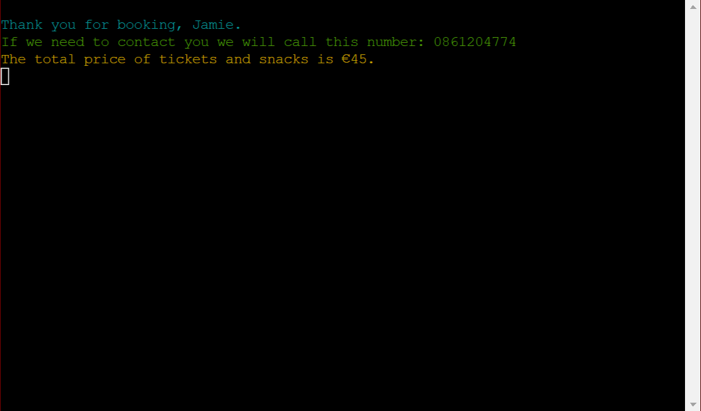

# Love Movies Cinema Booking System

[Love Movies Live Site](https://love-movies123.herokuapp.com/)

[Github Repo](https://github.com/JamieT966/project-portfolio-3)

Love Movies is in need of a cinema booking system. This booking system will allow Love Movies to have customers book cinema tickets online with various movie choices. Within the same booking system customers can order as many snacks as they like or none at all. At the end the customer is presented with their details and the total cost.

**The business goals of this quiz:**
* Allows booking of movies online which will increase sales as another sales channel has been opened.
* Online booking means that customers are guaranteed a seat and will result in less unhappy customers.
* Also allows the ordering of snacks online which will increase revenue.

**The customer goals of this quiz:**
* Clear and easy way to book their favourite movies with ease.
* Provides customers with an easy way to order snacks.
* Allows the customer to book multiple seats.

## **Features**

### Love Movies | Introduction Screen

* The user is first met with a welcome screen introducing them to Love Movies. Featuring Love Movies written in a pyfiglet style. With the option to start the program in green colouring. 


### Love Movies | Movie Selection Screen

* This screen features information on ticket price cost and displays all current movies being shown at Love Movies. There is an input required of 1-4 depending on what movie a customer would like to see.


### Love Movies | Seat Selection Screen

* The seat selection screen asks the user how many tickets they would like. Below it tells the user the maximum amount of tickets that can be purchased.

* This screen also features an exit button, that when 'x' is input, will restart the program.


### Love Movies | Snack Selection Screen

* The customer is presented with a choice of snacks on this screen. The customer can choose between 4 snacks with an option for no snacks.

* This screen also features an exit button, that when 'x' is input, will restart the program.


### Love Movies | Order Complete? Screen

* When a customer has selected a snack from the snack selection screen they are taken to this screen asking if their order is complete. 

* If the customer inputs yes they are taken to the next screen. If the customer inputs no they are taken back to the snack selection screen to chose another snack.


### Love Movies | Contact Details Screen

* This screen prompts the user for their name and phone number.

* The phone number input is then validated to ensure that it is a number.



### Love Movies | End Screen

* The end page will thank the user for booking using the name provided in the contact details screen.

* It will then inform the user that if Love Movies has any issues or needs to contact them they will get in touch with the phone number provided in the contact details screen.


### Features Left to Implement in The Future

* Different ticket prices is something that could be looked at as a future development. For example, Adult, Child, Student. Love Movies could also implement different prices for different movies in the future.

* In the future, I would like to improve upon the Google Sheets database so any no coding person is able to enter and remove movies when necessary.

* Another feature to implement would be for each order to have a unique booking reference.

## **Testing**

|Test Description|Expected Outcome|PASS/FAIL|Comments|
|:----|:----|:----|:----|
|When input on movie selection screen is selected the correct input is returned.|1 = The Batman|PASS|Input passes for all numbers 1-4|
|When other input is entered on the movie selection screen an error is returned and question repeats.|cat = Sorry, we were looking for a number between 1 and 4.|PASS|Anything other than 1-4 entered results in that error
message.|
|When input on seat selection is 1-6 it runs.|1-6 input results in the
program running.|PASS|Works.|
|When other input is entered on the seat selection screen an error is returned and question repeats.|dog = Sorry, we were looking for a number between 1 and 6.|PASS|Anything other than 1-6 entered results in that error message.|
|When ‘x’ input is entered on the seat selection screen an error is returned and question repeats.|Returns user to start of program|PASS|Program does what it says.|
|When input on snack selection screen is selected the correct input is returned.|3 = Nachos|PASS|Input passes for all numbers 1-5|
|When other input is entered on the seat selection screen an error is returned and question repeats.|72 = Sorry, we were looking for a number between 1 and 5.|PASS|Anything other than 1-5 entered results in that error message.|
|When ‘x’ input is entered on the snack selection screen an error is returned and question repeats.|Returns user to start of program|PASS|Program does what it says.|
|When input of ‘yes’ is entered the program continues.|Yes = program continues|PASS|Program advances.|
|When input of ‘no’ is entered the program continues.|No = program loops back to snack selection.|PASS|Program loops back to snack selection.|
|Name input is prompted|Yes = Please write your name: appears next.|PASS|Program runs as expected.|
|Phone number input is prompted|Yes = Please write your phone number:
appears next.|PASS|Program runs as expected.|
|When anything other than a number is entered an error occurs.|frog = Phone number
can only contain numbers.|PASS|Anything that is not a digit is rejected with error.|
|2 tickets for The Batman, Large Popcorn and Nachos|€29|PASS|Result: €29|
|4 tickets for Star Wars: The Empire Strikes Back, Big bag of sweets and Hot Dog|€49|PASS|Result: €49|
|5 tickets for Lord of the Rings: The Two Towers, no snacks|€50|PASS|Result: €50|
|1 ticket for Iron Man, Large Popcorn and Hot Dog|€20|PASS|Result: €20|

## **Bugs**

* A bug that I found while creating this quiz was that when transferring the score variable from one javascript file to another was that when all answers were correct it would be one scoreless. E.g. all answers are correct but 9/10.
I found that I was storing the score variable after I was directing the user to another page, meaning the score was 10 before clicking the next button but 9 after clicking the button.

* A second bug that myself and a tutor found was that any event listeners added into my javascript file outside a function threw an error. I resolved this by using onclick attributes in my HTML files.

## **User Experience**

### Strategy

The client wanted a quiz to aid in their chemical safety training. Chemstore travels out to host the event and would like a multiple choice quiz to test attendees knowledge either at the end of the day or halfway through the day.

### Scope

I discussed with the client and we decided the scope of this project together. I gave an overview of what was on the table. For example, the basic outline of the quiz was to be delivered with a variable keeping track of the current page and another variable keeping track of the user's score.

Unfortunately, due to time constraints, the ability to issue the user with a certificate based on score fell out of the scope for this project. This can be revisited at a later date.

### Structure

For the main structure, I implemented a start screen hosting a modal with the rules. Once the start button is clicked then the quiz begins. For continuity, the Chemstore logo stays fixed to the top and three links are fixed to the bottom. These link to the company's website, LinkedIn and Twitter.

All buttons colours invert when hovered over to demonstrate good interactive design.

A results page tells the user their score and whether or not they need to restart the quiz.

### Skeleton

Initially, I drew out all the functions required and a rough idea of how I wanted the quiz to look.

I then created a wireframe using Balsamiq. 


### Surface

For colours, I went with the Chemstore brand colour palette as I felt these looked nice and it offered continuity across the Chemstore brand.

```--cgreen: #98c244; --cred: #e6554d; --cnavy: #2d3347; white #ffffff```


## **Technologies**

1. HTML
2. CSS
3. JavaScript
4. Gitpod.io - for writing the code. Using the command line for committing and pushing to Git Hub
5. GitHub - Used to host repository
6. GIT - for version control of the project.
7. [Beautifier](https://beautifier.io/) - Used to beautify my HTML, CSS and JavaScript.

## **Deployment**

The website is hosted by GitHub Pages and the live page can be found here: [Chemstore Chemical Awareness Quiz](https://jamiet966.github.io/project-portfolio-2/)

**The Steps I Took To Deploy on GitHub Pages:**

1. Went to github.com
2. Under Repositories click on the desired project.
3. Click on Settings just over the green Gitpod button.
4. On the left navigation menu, find and click Pages.
5. Under Source, change Branch to main and the files to /root and click save.
6. Wait a few minutes and your repository will be live on Github Pages.


As this website is hosted by GitHub pages it is directly deployed from the repository's master branch. This means that the deployed site will automatically update from any commits from the master branch of my repository.

**The Steps I Took To Push Changes to Live website:**

1. When have completed a section of code, in the terminal window: `git add .` or `git add index.html "or other file"`.
2. `git commit -m "Your commit message here`.
3. `git push`.

To run a local copy, you can clone into any editor by pasting this: `git clone https://github.com/JamieT966/project-portfolio-2.git` into your editor.

## **Credits**

### Content

* All content came from the Chemstore chemical awareness training PowerPoint presentation. This gave me everything I needed to create questions and answers.

### Media

* The Chemstore logo came from the Chemstore website. [Chemstore.ie](https://www.chemstore.ie/)

### Acknowledgments

* First and foremost my mentor Brian Macharia, has been a great help on this project.

* The Code Institute tutors, in particular, Rebecca and John were immensely helpful and patient guiding me through solving the issues I was having.

* I would like to credit this students quiz for giving me the idea of having a 'hide' class that could be toggled on and off depending on the need. [Geo Quiz](https://github.com/lee-joanne/geo-quiz)

* I also need to credit W3 schools for their modal instructions that I completely copied and then adjusted to the needs of my quiz. [W3 Schools Modals](https://www.w3schools.com/howto/howto_css_modals.asp)

* I also watched many YouTube videos for ideas but I did not follow any particular video.